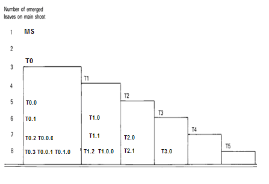
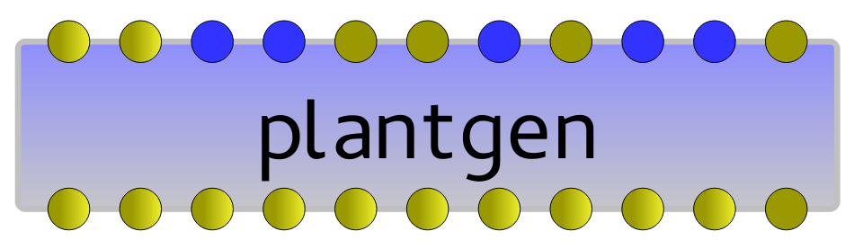
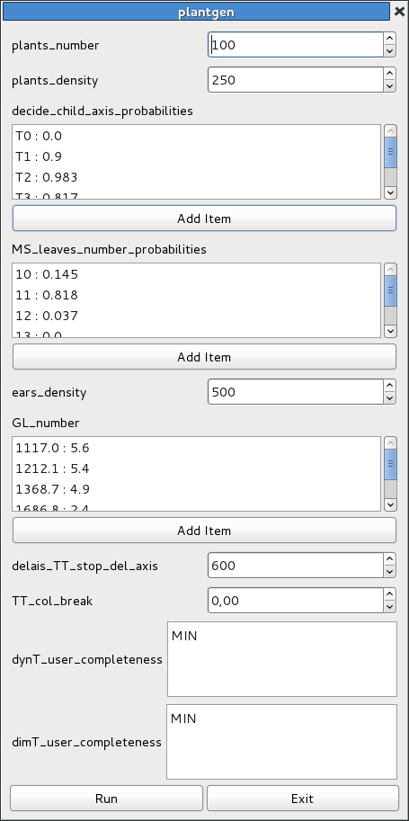
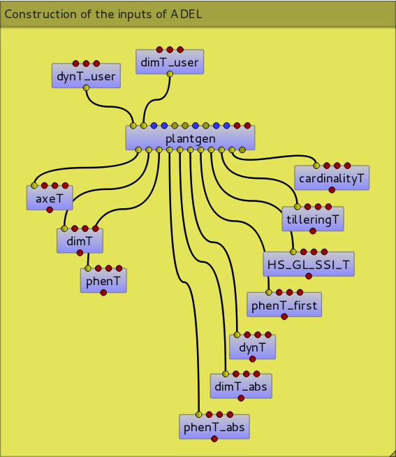
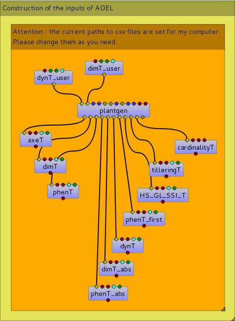
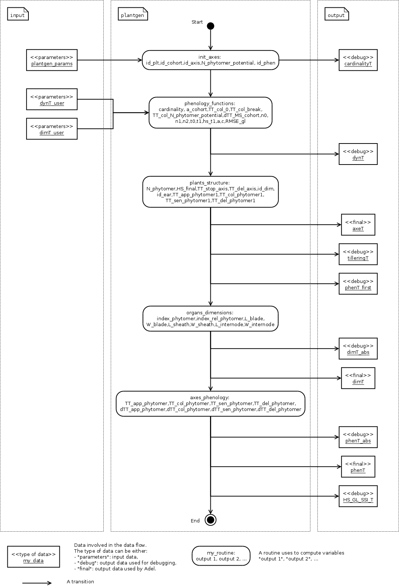

   
++++++++++++++++++++

.. sidebar:: Summary

    :Topic: *Alinea.Adel Documentation*
    :Release: |release|
    :Date: |today|
    :Authors: Mariem ABICHOU, Bruno ANDRIEU, Camille CHAMBON and Shouyang Liu
    :Target: users
 
.. contents:: **Alinea.Adel Documentation**
   

General introduction 
**********************

ADEL-Wheat (Architectural model of DEvelopment based on L-systems) is designed for
simulating the 3D architectural development of the shoots of wheat plants. The model has been
coupled with a light model adapted to field conditions (Caribu model), in order to allow calculating the
light interception by individual phytoelements during the crop cycle. Applications of such a tool range from the
interpretation of remote-sensing signals, to the estimation of crop light use efficiency, or to the
assistance in the ecophysiological analysis of plant response to light conditions.
The model is based on an analysis of developmental and geometrical similarities that exist among phytomers, to allow a
concise parameterisation. Parameterising the model requires using experimental data to document a set of inputs described below.

Beside these user inputs, Adel also make use of constants and of relations (set and 'readable' in Adel.R, but not documented)
describing coordination of leaves, dynamics of geometry, computation of visibility and progression of senescence as a function of ssi.
See Robert et al (Functional Plant Biology 2008) for description. The next figure 
shows the global dataflow of Adel:

.. todo:: add a global data-flow of Adel

Simulations are visually realistic. And the model was shown to correctly reproduce important agronomic features such as kinetics of LAI and of plant height.
The following table presents simulation of Soissons variety with nitrogen fertilization: 

.. list-table::
    :widths: 10 10 10
    :header-rows: 1

    * - .. image:: image/model_1_0_0.png
          :width: 100%  
      - .. image:: image/model_28_90_0.png
          :width: 100%
      - .. image:: image/model_28_0_180.png
          :width: 100%
    * - 1 plant, elevation=0, azimut=0 
      - 28 plants, elevation=90, azimut=0
      - 28 plants, elevation=0, azimut=180

.. _adel_input:

Description of Adel's inputs
*******************************

Adel requires three kinds of inputs to be provided by the user:

 * inputs characterizing the development of plants in the canopy (topology, developmental rate and size of plants)
 * inputs characterizing the geometry of axes and of leaves
 * inputs characterizing the simulation (time step..) and the plot configuration (number of plants, position)

Units and conventions
- Dimension are expressed in cm
- Thermal time is expressed in °CD

Position of a phytomer on an axis: Most often (as described below) phytomer position in Adel are counted acropetally and are normalized relatively to the total number of phytomers
(leaf 1 relative position is 1/nf and flag leaf relative position is 1). Use of relative positions was chosen to allow sharing data between axes differing by the total number of phytomers
In later versions of Adel the relative phytomer number should be changed by the absolute one. With the convention that 1 is referring to the first true leaf.

.. _development_input:

Inputs describing development
=================================
Development is parameterized in a Rlist containing 3 tables (:ref:`axeT <axeT>`, :ref:`dimT <dimT>` and :ref:`phenT <phenT>`). 

These tables have dependencies (cross references). However some may be compatible with others if cross references are maintained. This allows for recombination of parameters.

.. _axeT:

axeT : *Master table allowing to organize the information plant per plant*
---------------------------------------------------------------------------
:ref:`axeT <axeT>` is the master table that organizes how each plant is described.
For each plant, the table contains a few explicit parameters that describe the phenology and the number of modules (eg time of appearance, number of axes and number of leaves on axes)
and identifiers that refer to information given in the other tables (:ref:`dimT <dimT>`, :ref:`phenT <phenT>`, :ref:`earT <earT>`).

All plants to be used for the reconstruction must be listed in :ref:`axeT <axeT>`. If only one plant is given, Adel will clone that plant. 
To have a correct simulation of tiller dynamics at the plot level, a minimum of 30 plants is recommended.

There is one line per axis. Columns are :

.. list-table::
    :widths: 10 50
    :header-rows: 1

    * - Column
      - Description
    * - **id_plt**
      - Number (int) identifying the plant to which the axe belongs
    * - **id_cohort**
      - Number (int) identifying the cohort to which the axe belongs
    * - **id_axis**
      - Identifier of the botanical position of the axis on the plant. "MS" refers 
        to the main stem, "T0", "T1", "T2",..., refers to the primary tillers, "T0.0", 
        "T0.1", "T0.2",..., refers to the secondary tillers of the primary tiller "T0", and 
        "T0.0.0", "T0.0.1", "T0.0.2",..., refers to the tertiary tillers of the secondary 
        tiller "T0.0". See :ref:`botanical_positions`. 
    * - **N_phytomer_potential**
      - The *potential* total number of vegetative phytomers formed on the axis. N_phytomer_potential 
        does NOT take account of the regression of some axes.
    * - **N_phytomer**
      - The *effective* total number of vegetative phytomers formed on the axis. N_phytomer 
        does take account of the regression of some axes.
    * - **HS_final**
      - The Haun Stage at the end of growth of the axis.
    * - **TT_stop_axis**
      - If the axis dyes: thermal time (since crop emergence) of end of growth. If the axis grows up to flowering:  *NA*  
    * - **TT_del_axe**
      - If the axis dyes: thermal time (since crop emergence) of disappearance. If the axis grows up to flowering:  *NA*  
    * - **id_dim**
      - key (int) linking to :ref:`dimT <dimT>`. id_dim allows referring to the data that describe the dimensions of the phytomers of the axis
    * - **id_phen**
      - key (int) linking to :ref:`phenT <phenT>`. id_phen allows referring to the data that describe the phenology of the axis
    * - **id_ear**
      - Key (int) linking to :ref:`earT <earT>`. id_ear allows referring to the data that describe the ear of the axis. 
        For the regressive axes, id_ear=NA. For the non-regressive axes, id_ear=1. 
    * - **TT_em_phytomer1**
      - Thermal time (relative to canopy appearance) of tip appearance of the first true leaf (not coleoptile or prophyll)
    * - **TT_col_phytomer1**       
      - Thermal time (relative to canopy appearance) of collar appearance of the first true leaf                              
    * - **TT_sen_phytomer1**
      - Thermal time (relative to canopy appearance) of full senescence of the first true leaf (this is : thermal time when SSI= 1)
    * - **TT_del_phytomer1**
      - Thermal time (relative to canopy appearance) of disappearance of the first true leaf
       

.. _botanical_positions:

   Botanical position of the axis on the plant. 

See :download:`an example of axeT <../../test/data/test_plantgen/MIN_MIN/axeT.csv>`.
   

.. _dimT:

dimT : *description of the dimensions of leaf blades, sheath and internodes*
------------------------------------------------------------------------------
:ref:`dimT <dimT>` allows to describe a number of profiles of dimension, each profile 
being associated to a value of id_dim. Dimensions of organs must be given for each 
of the id_dim mentioned in :ref:`axeT <axeT>`.

Positions on an axis are expressed as relative position (index_rel_phytomer = phytomer rank/N_phytomer);

Use of relative position makes it possible to use a same profile of dimension for axes differing in the final number of phytomers (N_phytomer);
Use of relative position makes it possible to document a profile with only some the phytomers on an axis:
Missing data will be estimated by linear interpolation according to index_rel_phytomer;  

Actual dimension of the blade, sheath and internode of an axis are hence calculated according to id_dim and N_phytomer.

There is one line per phytomer documented.

Columns are :

.. list-table::
    :widths: 10 50
    :header-rows: 1

    * - Column
      - Description
    * - **id_dim**
      - the identifier referred to in :ref:`axeT <axeT>`. By convention, if the current id_dim 
        ends by ``0`` (e.g. id_dim=1110), then the current line documents 
        the dimensions of a regressive axis. If the current id_dim ends by 
        ``1`` (e.g. id_dim=1111), then the current line documents the 
        dimensions of a non-regressive axis.
    * - **index_rel_phytomer** 
      - The relative phytomer position : index_rel_phytomer = phytomer rank/N_phytomer
    * - **L_blade**
      - length of the mature blade (cm)
    * - **W_blade**
      - Maximum width of the mature leaf blade (cm)
    * - **L_sheath** 
      - Length of a mature sheath (cm)
    * - **W_sheath** 
      - Diameter of the stem or pseudo stem at the level of sheath (cm)
    * - **L_internode** 
      - Length of an internode (cm)
    * - **W_internode** 
      - Diameter of an internode (cm)
      
See :download:`an example of dimT <../../test/data/test_plantgen/MIN_MIN/dimT.csv>`.

.. _phenT:

phenT : *description of phenology of axes*
-----------------------------------------------------------------
:ref:`phenT <phenT>` controls the dynamics of leaf appearance, ligulation, senescence and disappearance.
Internal rules of Adel coordinate sheaths and internodes to the blades so that :ref:`phenT <phenT>` 
controls indirectly the whole dynamics of plant development.

Positions on an axis are expressed as relative positions.

One timing of development has to be documented for each value taken by id_phen in :ref:`axeT <axeT>`; axes sharing a same value of id_phen will share the same timing;
Use of relative position makes it possible to use a same developmental timing for axes differing in the final number of phytomers;
Use of relative position makes it possible to document a developmental timing with a number of value higher than the number of phytomers on an axis:
this is required because the dynamics of SSI shows a complex behavior(see below)

Timing of developmental events on a leaf is given relative to the timing of the event on leaf 1 of the axis;
Actual timing is computed from :ref:`phenT <phenT>` and the data concerning leaf 1 in :ref:`axeT <axeT>`. 

For each id_phen, there is one line per value of index_rel_phytomer documented. For a smooth description of the 
dynamics of SSI from crop appearance to maturity, approximately 40 values of index_rel_phytomer should be documented (for each value of id_phen).
More over for each value of id_phen, one line should be documented for index_rel_phytomer = 0, so as to allow interpolation.

Columns are :

.. list-table::
    :widths: 10 50
    :header-rows: 1

    * - Column
      - Description
    * - **id_phen** 
      - the index referred to in :ref:`axeT <axeT>`
    * - **index_rel_phytomer** 
      - normalized phytomer position, starting from index_rel_phytomer = 0
    * - **dTT_em_phytomer** 
      - Thermal time of the appearance of the tip of leaf out of the whorl made by the older blade; expressed as thermal time since TT_em_phytomer1
    * - **dTT_col_phytomer**
      - Thermal time of the appearance of collar; expressed as thermal time since TT_col_phytomer1
    * - **dTT_sen_phytomer** 
      - Thermal time for which SSI = n (where n is the phytomer rank); expressed as thermal time since TT_sen_phytomer1
    * - **dTT_del_phytomer** 
      - Thermal time after which the leaf blade is destroyed and is not displayed in the 3D mock-up anymore; expressed as thermal time since TT_del_phytomer1

See :download:`an example of phenT <../../test/data/test_plantgen/MIN_MIN/phenT.csv>`.

.. _earT:

earT : *description of ear dimension and phenology*
----------------------------------------------------
There is one line per ear type (referred by id_ear in :ref:`axeT <axeT>`)

.. list-table::
    :widths: 10 50
    :header-rows: 1

    * - Column
      - Description
    * - **id_ear** 
      - the identifier referred to in :ref:`axeT <axeT>`
    * - **dTT_ap_ear** 
      - Thermal time interval between flag leaf ligulation and ear appearance (appearance of the tip of highest spike, discounting the awn)
    * - **dTT_ap_peduncle** 
      - Thermal time interval between flag leaf ligulation and peduncle appearance (appearance of the base of the ear) 
    * - **TT_z92** 
      - Thermal time (relative to canopy emergence) of the end of grain filling (corresponding on z92 on Zadoks scale)
    * - **L_peduncle** 
      - length of the ear peduncle: from the last node to the base of the ear (cm)
    * - **W_peduncle** 
      - diameter of the ear peduncle (cm)
    * - **L_ear** 
      - length of the ear without awns (cm)
    * - **A_ear** 
      - projected area of ear without awn  (cm2)
    * - **L_spike** 
      - Total length of the spike : from base of the ear to the top of the awns (cm)    

.. _ssi2sen:

ssi2sen : *description of progression of senescence in upper leaf blades as a function of SSI*
-----------------------------------------------------------------------------------------------
Adel considers two categories of phytomers for describing the progression of senescence in leaf blades.

* for lower leaves, the senescence progresses linearly as function of SSI and blades sequentially: the senescence of blade at rank n starts when senescence of blade n-1 has finished. 
  This means that the senesced fraction of leaf n is : 1+SSI -n. It depends only in ssi and there is no need for additional parameters.
* for upper leaves, the progress of senescence is more complex and several leaf blades senesce simultaneously: 
  SSi2senT contains data to calculate the fraction of senesced area of each upper leaves as function of ssi.

The upper leaves correspond approximately to the leaves beard by an elongated internode. 
The number of lower leaves showing a linear progress of senescence is called Nsenlow;
The number of upper leaves showing a complex progress is called Nsenup

All upper leaf blades start to senesce at the same time, that is at :math:`SSI = Nsenlow`; 
Senescence of each upper leaf blade progresses first at a slow rate,identical for all leaves, then at a fast rate.

The parameter used to describe these kinetics are the value of the slow rate (R_sen1), the value of ssi (dssit1) at the onset of fast senescence 
and the value of SSI (dssit2) at full senescence for each upper leaf. 

The table defines the parameter values for the upper leaves.
There is one line per upper leaf and the number of lines of the file must be Nsenup
The values d_SSIt1 and dssit2 are specified in term of difference with the ssi at onset of upper leaves senecence (Nsenlow)

It should be noted that the present description of progress of senescence is over-parameterized, resulting in a constraint between parameters value.
This comes from the fact that at any time the sum of the rate of progress of senescence for all leaves should be one. 
Complying with this constraint is not straightforward. So a user that do not know precisely the value of parameters in his experiment should probably use the default values to ensure a consistent behavior.

.. list-table::
    :widths: 10 50
    :header-rows: 1

    * - Column
      - Description
    * - **N_senup**
      - Number of leaves that show two phases during senescence (the value is repeated for all lines!)
    * - **R_sen1**
      - Rate of progress of senescence during phase 1 (the value is repeated for all lines !)
    * - **dssit1**
      - (SSI when the leaf blade starts phase 2) - Nsenlow)
    * - **dssit2**  
      - (SSI when the leaf blade is 100% senesced - Nsenlow)

Inputs describing geometry
=============================
Input are required to define the geometry of leaves (normalized 2D shape, midrib curvature and azimuth) and the geometry of stems (inclination, azimuth)

Normalized 2D shapes are leaf width variations with distance to the base of the leaf, both axes being normalized so that max values is 1.

Normalized 2D shapes and midrib curvature are stored as collections and Adel will draw and individual leaf by scaling a 2D shape plus taking a midrib curvature from these collections. 

The inclination of axes is defined by two parameters DredT and Tillerinc.
DredT represents the horizontal distance between the main stem and a tiller at flowering.
Tillerinc represents the angle of insertion of a tiller at flowering.
When a tiller grows, it starts with angle of 3° compared to the vertical. Then, during the period of extension of the lower internode, insertion angle increases up to the value Tillerinc.
It will keep this value until the top of the stem reaches the distance DredT from the main stem. When this is reach, 
the two upper visible nodes rotate so that the top of the tillers remains at distance DredT. Any internode that elongate
later is vertical. Note that when sheath disappear, new node become visible and will become involved in the process.

genGoeaxe (see below) includes a parameter to randomly tilt the main stem of a small value around the vertical. When the main stem is tilted, all the plant follows

How to specify the geometric data
---------------------------------
The collections for 2D leaf shape and for leaf curvature should be specified as one list of lists of matrices for 2D shape and one list of matrices for midrib curvature.

* the first level in the list is for collection index 
* the second level is for matrix index.

See alea for more information.

Besides these collections, R functions should be provided as inputs. A first list of function is for defining the axis geometry;
A second list of functions is for selecting shapes in the collections mentioned above.

The first list should provide 3 R functions of axis number (0 = main stem) that return:
    * **azT** : the azimuth(deg) of the first leaf of the axis with reference to the azimuth of the parent axes
    * **incT** : the inclination (deg) of the base of the tiller compared with main stem
    * **dredT** : the distance (at maturity) between tiller and main stem

These functions can be generated by the predefined *genGeoAxe* node or be freely user-defined in a *freeGeoAxe* node.

In genGeoAxe 
The azimuth of a tiller stem is the same as that of the axilling main stem leaf. 
The azimuth of the first leaf of a primary tiller is with an angle of 75° relatively to that of the axilling main stem leaf.
For secondary tillers, the azimuth of the first leaf is also with a fixed angle relatively to that of the parent tiller.

A sample code of "geoAxe" function is:                                              

.. code-block:: r

    geoAxe <- list(
      azT = function(a) {
        ifelse(a == 0, 0, 75 + (runif(1)-0.5)*5) 
      },
      incT = function(a) {
        ifelse(a == 0, runif(1) * 5, 82 + (runif(1) - .5) * 5)
      },
      dredT = function(a) {
        ifelse(a == 0, 0, runif(1) * 7)
      }
    )

The second list should provide two Rfunctions for drawing in the collections of leaf shape

Inputs have to be axis number, leaf position, leaf position counted from top, and leaf stage, defined as current length/final length. 
Returned values have to be :

    * **azim** : the azimuth (deg) of the leaf compared to the previous one
    * **Lindex** : the index of the collection to use for leaf curvature

These functions can be generated by the predefined genGeoLeaf node or be freely user-defined in a *freeGeoLeaf* node:

A sample code for a "geoLeaf" function is be : 

.. code-block:: r

    geoLeaf <- list(
        Azim = function(a,n,ntop) {0 * runif(1)},
        Lindex = function(a,n,ntop,stage) {ntop + 1}
        

Inputs describing simulation
===============================
Time step is given as a list of values of thermal times for which a mock-up is to be produced.
Positions of plants within the plot are given externally from adel to a planter.

Inner options of ADEL 
========================

.. todo:: add reference to C.Fournier's and B.Andrieu's publications which describe 
          the working hypotheses, and remove the following subsections.

This section documents the inner options of ADEL.

Coordination in organ extension
----------------------------------
The thermal time of leaf tip appearance and leaf collar appearance given in :ref:`phenT <phenT>` are used to calculate a number of features;
- the leaf extension (blade + sheath) is simulated as starting 0,4 phyllochron between tip appearance, and having a constant rate (cm.°C-1.J-1) for a duration of 2 phyllochrons
- The model calculate the length of the hidden part of a leaf (whorl length) : at tip emergence, this hidden length is the blade length; 
at collar emergence this hidden length is taken as the length of sheath n-1; Between it is approximated by linear interpolation. 
This is used to calculate the length of the visible part of the leaf in the post processing treatments. Note that this calculation is not fully accurate because sheath n-1 stop growing before collar n emerges

The leaf extension is simulated as consisting sequentially of the blade extension, followed by the sheath extension. 

The internode extension is simulated as following sequentially the sheath extension, and taking place at a constant rate, for a duration of 1/(stemleaf) phyllochron
It is known that in grass, internode fast extension start at collar emergence. However there is no such calculation of collar emergence in the model: 
it expected that the synchronization with collar emergence will be reasonably well approximated by the synchronization implemented with the end of leaf extension.

The parameters for these coordinations are defined in AdelRunOption, which remained to be documented

Senescence of sheath and internodes
------------------------------------
The senescence of sheath n is simulated as being synchronous with the senescence of blade n+2
The disappearance of sheath n is simulated as synchronous with disappearance of blade n+1

There is no senescence implemented for internodes : they stay green.
For ear and peduncle : to be documented

On regressing tillers, individual leaf senescence is simulated from SSI with the same pattern as on non-regressing tillers.

Disappearance of dead tillers
-------------------------------
A dead tiller can be programmed to disappear some time after it stops growing. 
Only the blades and sheaths, not the internodes, disappear. This will be changed in further version, so that internode also disappear
When this happens, it has priority over the process of disappearance following leaf senescence. 

.. _plantgen:

Construction of the input tables 
***********************************

ADEL requires inputs characterizing the development of plants as described 
in :ref:`development_input`.

The :mod:`plantgen <alinea.adel.plantgen>` package allows the user who does not have 
a complete set of data to estimate the missing inputs. 
Inside this package, the module :mod:`plantgen_interface <alinea.adel.plantgen.plantgen_interface>` is 
the front-end for the generation of the tables :ref:`axeT <axeT>`, :ref:`dimT <dimT>` 
and :ref:`phenT <phenT>`. :mod:`plantgen_interface <alinea.adel.plantgen.plantgen_interface>` 
also permits to generate some other tables for debugging purpose. 
To construct :ref:`axeT <axeT>`, :ref:`dimT <dimT>`, :ref:`phenT <phenT>` and the debugging 
tables, the module :mod:`plantgen_interface <alinea.adel.plantgen.plantgen_interface>` 
uses the modules :mod:`plantgen_core <alinea.adel.plantgen.plantgen_core>`, 
:mod:`tools <alinea.adel.plantgen.tools>` and module :mod:`params <alinea.adel.plantgen.params>`. 
The diagram :ref:`static view <plantgen_static>` describes the dependencies 
between the different modules of the package :mod:`plantgen <alinea.adel.plantgen>`. 

.. todo:: add reference to M.Abichou's publication which describes the working hypotheses.

We have considered three possible levels of completeness of data, denoted as MIN, 
SHORT, and FULL. In the next subsections, we: 

* describe the levels of completeness of the data and of the parameters set 
  by the user,
* describe how to construct the inputs of ADEL from a Python interpreter, 
  using the routine :func:`gen_adel_input_data <alinea.adel.plantgen.plantgen.gen_adel_input_data>`. 
  This routine can be used whatever the level of completeness of the raw inputs, 
  adapting the processing automatically,
* describe how to construct the inputs of ADEL from the Visualea interface, 
  using the node ``plantgen``.
        
:func:`gen_adel_input_data <alinea.adel.plantgen.plantgen.gen_adel_input_data>` 
belongs to module :mod:`plantgen_interface <alinea.adel.plantgen.plantgen_interface>`. 
:func:`gen_adel_input_data <alinea.adel.plantgen.plantgen.gen_adel_input_data>` 
produces the following tables: 

* :ref:`axeT <axeT>`
* :ref:`dimT <dimT>`
* :ref:`phenT <phenT>`
* :ref:`phenT_abs <phenT_abs>`: the equivalent of :ref:`phenT <phenT>`, but 
  with absolute thermal times and absolute positions.
* :ref:`dimT_abs <dimT_abs>`: the equivalent of :ref:`dimT <dimT>`, but with 
  absolute positions.
* :ref:`dynT <dynT>`: the dynamic of the leaves for each type of axis. 
* :ref:`phenT_first <phenT_first>`: a subset of :ref:`phenT_abs <phenT_abs>`, 
  containing only the lines of :ref:`phenT_abs` which correspond to the first 
  phytomer of each axis.
* :ref:`HS_GL_SSI_T <HS_GL_SSI_T>`: the dynamic of Haun stage, green leaves and 
  senescent leaves when thermal time varies, for each cohort.
* :ref:`tilleringT <tilleringT>`: the dynamic of tillering.
* :ref:`cardinalityT <cardinalityT>`: the theoretical and the simulated 
  cardinalities of each cohort and each axis.
  
:func:`gen_adel_input_data <alinea.adel.plantgen.plantgen.gen_adel_input_data>` 
also produces a dictionary which stores the values of the arguments of 
:func:`gen_adel_input_data <alinea.adel.plantgen.plantgen.gen_adel_input_data>`. 
This dictionary is aimed to log the configuration used for the construction. 

The diagram :ref:`dynamic view <plantgen_dynamic>` describes 
the data flow when the user calls :func:`gen_adel_input_data <alinea.adel.plantgen.plantgen.gen_adel_input_data>`. 

in plantgen.  To help the user understanding the dataflow in plantgen, 

.. _levels_of_completeness:

The levels of completeness
=============================
The information needed to generate Adel input must be provided in two tables: 
``dynT_user`` and ``dimT_user``. ``dynT_user`` and ``dimT_user`` can  have 
different  levels  of  completeness:  ``FULL``,  ``SHORT`` and  ``MIN``.  
According  to  their  level  of completeness, ``dynT_user`` and ``dimT_user`` 
take different shapes and/or contents.

The table below list the specific designation in :func:`plantgen <alinea.adel.plantgen>`
for ``dynT_user``  and ``dimT_user`` for each level of completeness:

.. list-table::
    :widths: 10 40 25 25
    :header-rows: 1

    * - Level of completeness
      - Description
      - dynT_user
      - dimT_user
    * - **FULL**
      - the table contains data for 
        *at least* each most frequent 
        non-regressive axis.  
      - :ref:`dynT_user_FULL`
      - :ref:`dimT_user_FULL`
    * - **SHORT**
      - the table contains data for 
        *exactly* each most frequent 
        non-regressive axis.
      - :ref:`dynT_user_SHORT`
      - :ref:`dimT_user_SHORT`
    * - **MIN**
      - the table contains data for 
        the most frequent main stem only. 
      - :ref:`dynT_user_MIN`
      - :ref:`dimT_user_MIN`
      
.. seealso:: the documentation of :class:`DataCompleteness <alinea.adel.plantgen.plantgen.DataCompleteness>`
             in the :ref:`adel_reference`.                       
      
.. _construct_inputs_from_interpreter:

Construction of Adel input tables using the Python interpreter
================================================================
:func:`gen_adel_input_data <alinea.adel.plantgen.plantgen.gen_adel_input_data>` 
can be used from Python interpreter.

First we explain the arguments of :func:`gen_adel_input_data <alinea.adel.plantgen.plantgen.gen_adel_input_data>` 
that the user has to define. Second we present a complete code example to use 
:func:`gen_adel_input_data <alinea.adel.plantgen.plantgen.gen_adel_input_data>` 
from a Python interpreter.

.. _user_arguments:          

The arguments to define by the user
-------------------------------------
The arguments to define are:

* *dynT_user*: the leaf dynamic parameters set by the user,
* *dimT_user*: the dimensions of the axes set by the user,
* *plants_number*: the number of plants to be generated,
* *plants_density*: the number of plants that are present 
  after loss due to bad emergence, early death..., per square meter,
* *decide_child_axis_probabilities*: the probability of emergence of an axis 
  when the parent axis is present. *decide_child_axis_probabilities* are set 
  only for axes belonging to primaries tillers.
* *MS_leaves_number_probabilities*: the probability distribution 
  of the final number of main stem leaves,
* *ears_density*: the number of ears per square meter,
* *GL_number*: the thermal times of GL measurements and corresponding values of green leaves number, 
* *delais_TT_stop_del_axis*: the thermal time between an axis stop growing and its disappearance,
* *TT_hs_break*: the thermal time when the rate of progress Haun Stage vs thermal time is changing. 
  If phyllochron is constant, then *TT_hs_break* is 0.0.
* *inner_params*: the values to overwrite the inner parameters with. See 
  :ref:`inner_parameters_for_construction` for more details. 
  
.. important:: 
  
    * :func:`gen_adel_input_data <alinea.adel.plantgen.plantgen.gen_adel_input_data>` 
      checks automatically the validity of these arguments, EXCEPT for *inner_params*. 
      Thus, the user should be sure of what he is doing when setting the *inner_params*.
    
    * only *dynT_user* and *dimT_user* are mandatory. For all other arguments, default 
      value is used if no value is passed by the user. 
  
  
Code example
-------------
Now let's see a complete code example to use 
:func:`gen_adel_input_data <alinea.adel.plantgen.plantgen.gen_adel_input_data>` 
from a Python interpreter::
    
    # import the pandas library. In this example, pandas is used to read and 
    # write the tables.
    import pandas

    # read the dynT_user_MIN table. "dynT_user_MIN.csv" must be in the working directory. 
    dynT_user = pandas.read_csv('dynT_user_MIN.csv')
        
    # read the dimT_user_MIN table. "dimT_user_MIN.csv" must be in the working directory.
    dimT_user = pandas.read_csv('dimT_user_MIN.csv')    
    
    # define the other arguments
    plants_number = 100
    plants_density = 250
    decide_child_axis_probabilities = {'T0': 0.0, 'T1': 0.900, 
                                       'T2': 0.983, 'T3': 0.817, 
                                       'T4': 0.117}
    MS_leaves_number_probabilities = {'10': 0.145, 
                                      '11': 0.818, 
                                      '12': 0.037, 
                                      '13': 0.0, 
                                      '14': 0.0}
    ears_density = 500
    GL_number = {1117.0: 5.6, 1212.1:5.4, 
                 1368.7:4.9, 1686.8:2.4, 
                 1880.0:0.0}
    delais_TT_stop_del_axis = 600
    TT_hs_break = 0.0
    inner_params = {'DELAIS_PHYLL_COL_TIP_1ST': 1.0,
                    'DELAIS_PHYLL_COL_TIP_NTH': 1.6}
    
    # launch the construction
    from alinea.adel.plantgen.plantgen import gen_adel_input_data
    (axeT, 
    dimT, 
    phenT, 
    phenT_abs, 
    dimT_abs, 
    dynT, 
    phenT_first,
    HS_GL_SSI_T,
    tilleringT,
    cardinalityT,
    config) = gen_adel_input_data(dynT_user, 
                                  dimT_user, 
                                  plants_number,
                                  plants_density,  
                                  decide_child_axis_probabilities, 
                                  MS_leaves_number_probabilities, 
                                  ears_density, 
                                  GL_number, 
                                  delais_TT_stop_del_axis, 
                                  TT_hs_break, 
                                  inner_params)

    # write axeT, dimT and phenT to csv files in the working directory, replacing
    # missing values by 'NA' and ignoring the indexes (the indexes are the labels of
    # the lines). 
    axeT.to_csv('axeT.csv', na_rep='NA', index=False)
    dimT.to_csv('dimT.csv', na_rep='NA', index=False)
    phenT.to_csv('phenT.csv', na_rep='NA', index=False)
    
    # "axeT.csv", "dimT.csv" and "phenT.csv" are now ready to be used by Adel.

Otherwise, the function :func:`read_plantgen_inputs <alinea.adel.plantgen.plantgen.read_plantgen_inputs>` 
permits to define the :ref:`arguments <user_arguments>` by importing a Python module.

Using :func:`read_plantgen_inputs <alinea.adel.plantgen.plantgen.read_plantgen_inputs>` with 
the module :download:`plantgen_inputs.py <../../adel/data/plantgen_inputs.py>`, 
the preceding example becomes::

    from alinea.adel.plantgen.plantgen import read_plantgen_inputs
    # "plantgen_inputs_MIN.py" must be in the working directory 
    (dynT_user, 
     dimT_user, 
     plants_number, 
     plants_density,
     decide_child_axis_probabilities, 
     MS_leaves_number_probabilities, 
     ears_density, 
     GL_number, 
     delais_TT_stop_del_axis, 
     TT_hs_break,
     inner_params) = read_plantgen_inputs('plantgen_inputs_MIN.py')
    
    # launch the construction
    from alinea.adel.plantgen.plantgen import gen_adel_input_data
    (axeT, 
    dimT, 
    phenT, 
    phenT_abs, 
    dimT_abs, 
    dynT, 
    phenT_first,
    HS_GL_SSI_T,
    tilleringT,
    cardinalityT,
    config) = gen_adel_input_data(dynT_user, 
                                  dimT_user, 
                                  plants_number,
                                  plants_density,  
                                  decide_child_axis_probabilities, 
                                  MS_leaves_number_probabilities, 
                                  ears_density, 
                                  GL_number, 
                                  delais_TT_stop_del_axis, 
                                  TT_hs_break, 
                                  inner_params)

    # write axeT, dimT and phenT to csv files in the working directory, replacing
    # missing values by 'NA' and ignoring the indexes (the indexes are the labels of
    # the lines). 
    axeT.to_csv('axeT.csv', na_rep='NA', index=False)
    dimT.to_csv('dimT.csv', na_rep='NA', index=False)
    phenT.to_csv('phenT.csv', na_rep='NA', index=False)
    
    # "axeT.csv", "dimT.csv" and "phenT.csv" are now ready to be used by Adel.
     
:func:`read_plantgen_inputs <alinea.adel.plantgen.plantgen.read_plantgen_inputs>` 
permits the user to store the arguments, so he can reuse them later. 

    
.. _construct_inputs_from_visualea:

Construction of Adel input tables using Visualea
====================================================
The node ``plantgen`` allows to construct the inputs of ADEL. 

   plantgen node
   
   
``plantgen`` is located in ``alinea.adel.plantgen``. 
You can access to ``plantgen`` through the package explorer of VisuAlea, 
or just typing "plantgen" in the Search tab of VisuAlea. 

The associated widget, which appears when you open ``plantgen``, permits to 
configure the construction. 

   plantgen widget

The following dataflow demonstrates how to use ``plantgen`` through Visualea:

   The alinea.adel.Tutorials.plantgen dataflow 

The user must select existing data nodes to set the input and ouput tables.

The following data-flow demonstrates another way to use ``plantgen`` through 
Visualea:

   The alinea.adel.Tutorials.plantgen_csv dataflow 

In this case the user must give the paths of csv files for inputs and outputs. 

.. warning:: the paths set in alinea.adel.Tutorials.plantgen_csv will not work 
             on your computer. You have to adapt them to your needs.

Finally, the node ``read_plantgen_inputs`` permits to define the values of the input ports of 
``plantgen`` by importing a Python module. ``read_plantgen_inputs`` is also located in 
``alinea.adel.plantgen``. 
    
For example, using ``read_plantgen_inputs`` with the module 
:download:`plantgen_inputs.py <../../adel/data/plantgen_inputs.py>`, 
the dataflow becomes:
    
    .. figure:: ./image/plantgen_csv_inputs_dataflow.png
       :width: 100%
       :align: center
        
       The alinea.adel.Tutorials.plantgen_csv_inputs dataflow 
   
``read_plantgen_inputs`` permits the user to store the values of the input ports, 
so he can reuse them later.

.. _inner_parameters_for_construction:

Inner parameters for the construction of the input tables 
========================================================== 
These parameters are:

* :attr:`SECONDARY_STEM_LEAVES_NUMBER_COEFFICIENTS <alinea.adel.plantgen.params.SECONDARY_STEM_LEAVES_NUMBER_COEFFICIENTS>`: 
  the coefficients *a_1* and *a_2* to calculate the final number of leaves on tillers from the final number of leaves on main stem.
* :attr:`EMF_1_MS_STANDARD_DEVIATION <alinea.adel.plantgen.params.EMF_1_MS_STANDARD_DEVIATION>`:
  the standard deviation in the thermal of emergence of plants in the plot.
* :attr:`LEAF_NUMBER_DELAY_MS_COHORT <alinea.adel.plantgen.params.LEAF_NUMBER_DELAY_MS_COHORT>`: 
  the delays between the emergence of the main stem and the emergence of each cohort.
* :attr:`N2_MS_DIV_N2_COHORT <alinea.adel.plantgen.params.N2_MS_DIV_N2_COHORT>`: 
  ratio between the maximum number of green leaves on the tillers and the maximum green leaves on the main stem
* :attr:`DELAIS_PHYLL_COL_TIP_1ST <alinea.adel.plantgen.params.DELAIS_PHYLL_COL_TIP_1ST>`: 
  delay between tip appearance and collar appearance for the first leaf only.
* :attr:`DELAIS_PHYLL_COL_TIP_NTH <alinea.adel.plantgen.params.DELAIS_PHYLL_COL_TIP_NTH>`: 
  delay between tip appearance and collar appearance for all leaves except the first one.
* :attr:`DELAIS_PHYLL_SEN_DISP <alinea.adel.plantgen.params.DELAIS_PHYLL_SEN_DISP>`: 
  the time during which a fully senesced leaf on a non-elongated internode remains on the plant.
* :attr:`DELAIS_REG_MONT <alinea.adel.plantgen.params.DELAIS_REG_MONT>`: 
  the time between the start of the regression and the start of MS elongation.   
* :attr:`TT_DEL_FHAUT <alinea.adel.plantgen.params.TT_DEL_FHAUT>`: 
  the thermal time at which leaves on elongated internode disappear.
* :attr:`FIRST_CHILD_DELAY <alinea.adel.plantgen.params.FIRST_CHILD_DELAY>`: 
  the delay between a parent cohort and its first possible child cohort
* :attr:`REGRESSION_OF_DIMENSIONS <alinea.adel.plantgen.params.REGRESSION_OF_DIMENSIONS>`: 
  the regression of the dimensions for the last 3 phytomers of each organ.

These parameters can be set by the user through the input argument *inner_parameters* 
of the function :func:`gen_adel_input_data <alinea.adel.plantgen.plantgen.gen_adel_input_data>`, or 
set directly in the module :mod:`params <alinea.adel.plantgen.params>`. 
They permit a finer parameterization of the construction.

See :mod:`documentation of params <alinea.adel.plantgen.params>` for more information.  

Description of Adel's outputs
*******************************

The function :func:`RunAdel <alinea.adel.AdelR.RunAdel>` permits to simulate 3D architectural 
development of the shoots of wheat plants, according to a list of dates (thermal times) and 
Adel's inputs (see :ref:`adel_input`). 

:func:`RunAdel <alinea.adel.AdelR.RunAdel>` returns a Python dictionary. Each key 
of the dictionary represents an output.   
The following table describes each of these outputs.

.. list-table::
    :widths: 10 50
    :header-rows: 1

    * - Output of RunAdel
      - Description
    * - **refplant_id**
      - plant id
    * - **axe_id**
      - axe id
    * - **ms_insertion**
      - phytomer insertion position, starting from the base (not normalized)
    * - **nff**
      - final number of leaves produced by the axe
    * - **HS_final**
      - final haun stage reached by the axe (determine regression or not)
    * - **numphy**
      - phytomer position (from bottom)
    * - **ntop**
      - phytomer position  (from top)
    * - **L_shape**
      - lamina length (cm)
    * - **Lw_shape**
      - lamina width (cm)
    * - **LsenShrink**
      - shrink in lamina width due to senescense. Width is the remaining width proptional to the blade width before senecened
    * - **LcType**
      - selector for first level in leaf database (ntop). First level is the leaf type indexed by the phytomer position (ntop).
    * - **LcIndex**
      - index for selecting the leaf geometry from the replicates of the same phytomer (LcType)
    * - **Linc**
      - inclination of the base of the lamina relatively to the sheath (deg)
    * - **Laz**
      - azimuth relative to the previous leaf ( Laz[1] = azT, Laz[2:end] = azim) (azT refers to the the azimuth(deg) of the first leaf of the axis with reference to the azimuth of the parent axe. azim refers to the azimuth (deg) of the leaf compared to the previous one. azT and azim are defined in the user-defined function, geoAxe and geoLeaf, respectively.)
    * - **Lpo**
      - proportion of green tissue in the lamina (on a length basis)
    * - **Lpos**
      - proportion of senescent tissue in the lamina (on a length basis)
    * - **Gd**
      - apparent diameter of the sheath
    * - **Ginc**
      -  inclination relative to of the previous sheath
    * - **Gpo**
      - proportion of green tissue in the sheath (on a length basis)
    * - **Gpos**
      - proportion of senescent tissue in the sheath (on a length basis)
    * - **Ed**
      - diameter of the internode in cm
    * - **Einc**
      -  inclination relative to of the previous internode
    * - **Epo**
      - proportion of green tissue in the internode (on a length basis)
    * - **Epos**
      - proportion of senescent tissue in the internode (on a length basis)
    * - **rph**
      - normalized phytomer position (= numphy/nff ) ?? to be confirmed
    * - **rssi**
      - relative senescence index (ssi - numphy)
    * - **rhs**
      - relative haun stage (haun stage - numphy)
      

Then, the function :func:`mtg_factory <alinea.adel.newmtg.mtg_factory>` permits to 
construct a MTG from the output of :func:`RunAdel <alinea.adel.AdelR.RunAdel>`.

Finally, the function :func:`mtg_interpreter <alinea.adel.mtg_interpreter.mtg_interpreter>` permits to 
add a geometry to the MTG computed by :func:`mtg_factory <alinea.adel.newmtg.mtg_factory>`. 

The resulting MTG has the following properties:

.. list-table::
    :widths: 5 10 100 30
    :header-rows: 1

    * - Scale
      - Lable
      - Properties (up to date 26/09/2014; may change)
      - Comments
    * - 1
      - plant*
      - azimuth, edge_type, label, position, refplant_id
      - *number of plants
    * - 2
      - MS/T*
      - HS_final, edge_type, label, nff, timetable
      - MS: main stem; * the order of tillers
    * - 3
      - metamer*
      - L_shape, edge_type, label
      - *the position of metamer (numphy)
    * - 4
      - internode
      - azimuth, diameter, edge_type, inclination, label, length, ntop, senesced_length, visible_length
      - 
    * - 4
      - sheath
      - azimuth, diameter, edge_type, inclination, label, length, ntop, senesced_length, visible_length
      - 
    * - 5
      - StemElement
      - area, azimuth, edge_type, geometry, green_area, green_length, inclination, is_green, label, length, offset, senesced_area, senesced_length
      - 
    * - 5
      - blade
      - diameter, edge_type, inclination, label, length, n_sect, ntop, rolled_length, senesced_length, shape_mature_length, shape_max_width, shape_xysr,visible_length
      - 
    * - 5
      - LeafElement1
      - area, edge_type, geometry, green_area, green_length, is_green, label, length, position_senescence, senesced_area, senesced_length, srb, srt
      - 

Appendices
************

The appendices describe the data used by Adel for pre and post-processings. 
The appendices also contains static and dynamic view of the system, to 
help the user understanding hwo it works. 

Construction of the input tables 
=================================
In this section we first present internal views of the package :mod:`plantgen <alinea.adel.plantgen>`:

* a :ref:`static view <plantgen_static>` to describe the dependencies between the different modules of :mod:`plantgen <alinea.adel.plantgen>`,
* a :ref:`dynamic view <plantgen_dynamic>` to describe the data flow when the user calls :func:`gen_adel_input_data <alinea.adel.plantgen.plantgen.gen_adel_input_data>`.

Then, we describe the data used in the construction of the input tables of Adel:

* :ref:`dynT_user_FULL <dynT_user_FULL>`: the dynamic of the Haun stage of 
  **at least** the most frequent non-regressive axes.
* :ref:`dynT_user_SHORT <dynT_user_SHORT>`: for each *id_axis*, the dynamic of the 
  Haun stage of **exactly** the most frequent non-regressive axes.
* :ref:`dynT_user_MIN <dynT_user_MIN>`: the dynamic of the Haun stage of 
  the most frequent main stem, and, for each primary axis, the thermal time when 
  Haun Stage is equal to the final number of phytomers. 
* :ref:`dimT_user_FULL <dimT_user_FULL>`: the dimensions of 
  **at least** the most frequent non-regressive axes.
* :ref:`dimT_user_SHORT <dimT_user_SHORT>`: the dimensions of 
  **exactly** the most frequent non-regressive axes.
* :ref:`dimT_user_MIN <dimT_user_MIN>`: the dimensions of the most frequent 
  main stem. 
* :ref:`phenT_abs <phenT_abs>`: the equivalent of :ref:`phenT <phenT>`, but 
  with absolute thermal times and absolute phytomer ranks.
* :ref:`dimT_abs <dimT_abs>`: the equivalent of :ref:`dimT <dimT>`, but with 
  absolute phytomer ranks.
* :ref:`dynT <dynT>`: the dynamic of the Haun stage for each axis. 
* :ref:`phenT_first <phenT_first>`: a subset of :ref:`phenT_abs <phenT_abs>`, 
  containing only the lines of :ref:`phenT_abs` which correspond to the first 
  phytomer of each cohort.
* :ref:`HS_GL_SSI_T <HS_GL_SSI_T>`: the dynamic of Haun stage, green leaves and 
  senescent leaves when thermal time varies, for each cohort. 
* :ref:`tilleringT <tilleringT>`: the dynamic of tillering.
* :ref:`cardinalityT <cardinalityT>`: the theoretical and the simulated cardinalities of 
  each cohort and each axis.
  
  
.. _plantgen_static:

Static view of plantgen
--------------------------------
This diagram describes the dependencies between the different modules of :mod:`plantgen <alinea.adel.plantgen>`.

.. image:: ./image/plantgen_static.png
  :width: 75%
  :align: center

.. _plantgen_dynamic:

Dynamic view of plantgen
--------------------------------
This diagram describes the data flow when the user calls :func:`gen_adel_input_data <alinea.adel.plantgen.plantgen.gen_adel_input_data>`.

  
.. _dynT_user_FULL:

dynT_user_FULL
--------------------------------
:ref:`dynT_user_FULL` is a table which describes the dynamic of the Haun stage of 
**at least** the most frequent non-regressive axes. The most frequent axes are 
the axes which have the most frequent number of phytomers.
 
:ref:`dynT_user_FULL` contains a line of data for **at least** each couple (*id_axis*, most frequent *N_phytomer_potential*), 
where *id_axis* and *N_phytomer_potential* are defined in :ref:`axeT <axeT>`.
    
Each line contains the following data: *id_axis*, *N_phytomer_potential*, *a_cohort*, 
*TT_col_0*, *TT_col_N_phytomer_potential*, *n0*, *n1* and *n2*. 
See :ref:`dynT` for the meaning of these parameters.

See :download:`an example of dynT_user_FULL <../../test/data/test_plantgen/FULL_FULL/dynT_user.csv>`.

.. _dynT_user_SHORT:

dynT_user_SHORT
--------------------------------
:ref:`dynT_user_SHORT` is a table which describes the dynamic of the Haun stage of 
**exactly** the most frequent non-regressive axes. The most frequent axes are 
the axes which have the most frequent number of phytomers. 

:ref:`dynT_user_SHORT` contains a line of data for **exactly** each couple (*id_axis*, most frequent *N_phytomer_potential*), 
where *id_axis* and *N_phytomer_potential* are defined in :ref:`axeT <axeT>`. The couples (*id_axis*, **NOT** most frequent *N_phytomer_potential*) 
are not documented in :ref:`dynT_user_SHORT`.

Each line contains the following data *id_axis*, *a_cohort*, *TT_col_0*, 
*TT_col_N_phytomer_potential*, *n0*, *n1* and *n2*. 
See :ref:`dynT` for a description of these parameters.

See :download:`an example of dynT_user_SHORT <../../test/data/test_plantgen/SHORT_SHORT/dynT_user.csv>`.

.. _dynT_user_MIN:

dynT_user_MIN
--------------------------------
:ref:`dynT_user_MIN` is a table which describes the dynamic of the Haun stage of 
the most frequent main stem. The most frequent main stem is the 
main stem which has the most frequent number of phytomers.
:ref:`dynT_user_MIN` also contains, for each primary axis, 
the thermal time when Haun Stage is equal to the final number of phytomers.

The first line contains the following data: *id_axis*, *a_cohort*, *TT_col_0*, 
*TT_col_N_phytomer_potential*, *n0*, *n1* and *n2*. 
In the other lines, only *id_axis* and *TT_col_N_phytomer_potential* are documented: 
*a_cohort*, *TT_col_0*, *n0*, *n1* and *n2* are NA (i.e. Not Available). 
 
See :ref:`dynT` for a description of these parameters.

See :download:`an example of dynT_user_MIN <../../test/data/test_plantgen/MIN_MIN/dynT_user.csv>`.

.. _dimT_user_FULL:

dimT_user_FULL
--------------------------------
:ref:`dimT_user_FULL` is a table which documents the dimensions of 
**at least** the most frequent non-regressive axes. The most frequent axes are 
the axes which have the most frequent number of phytomers. 

:ref:`dimT_user_FULL` contains a line of data for **at least** each couple (*id_axis*, most frequent *N_phytomer_potential*), 
where *id_axis* and *N_phytomer_potential* are defined in :ref:`axeT <axeT>`.

Each line contains the following data: *id_axis*, 
*N_phytomer_potential*, *index_phytomer*, *L_blade*, *W_blade*, *L_sheath*, *W_sheath*, 
*L_internode* and *W_internode*. *id_axis* are the botanical positions (see 
:ref:`botanical_positions`). *N_phytomer_potential* are the final number of phytomers. The 
other data are the same as the ones in :ref:`dimT_abs`.

See :download:`an example of dimT_user_FULL <../../test/data/test_plantgen/FULL_FULL/dimT_user.csv>`.

.. _dimT_user_SHORT:

dimT_user_SHORT
--------------------------------
:ref:`dimT_user_SHORT` is a table which documents the dimensions of 
**exactly** the most frequent non-regressive axes. The most frequent axes are 
the axes which have the most frequent number of phytomers. 

:ref:`dimT_user_SHORT` contains a line of data for **exactly** each couple (*id_axis*, most frequent *N_phytomer_potential*), 
where *id_axis* and *N_phytomer_potential* are defined in :ref:`axeT <axeT>`. The couples (*id_axis*, **NOT** most frequent *N_phytomer_potential*) 
are not documented in :ref:`dimT_user_SHORT`.

Each line contains the following data: *id_axis*, *index_phytomer*, *L_blade*, *W_blade*, *L_sheath*, *W_sheath*, 
*L_internode* and *W_internode*. *id_axis* are the botanical positions (see 
:ref:`botanical_positions`). *N_phytomer_potential* are the final number of phytomers. The 
other data are the same as the ones in :ref:`dimT_abs`.

See :download:`an example of dimT_user_SHORT <../../test/data/test_plantgen/SHORT_SHORT/dimT_user.csv>`.
        

.. _dimT_user_MIN:

dimT_user_MIN
--------------------------------
:ref:`dimT_user_MIN` is a table which documents the dimensions of each phytomer of 
the most frequent main stem. The most frequent main stem is the 
main stem which has the most frequent number of phytomers.
Each line contains the following data: *index_phytomer*, *L_blade*, *W_blade*, 
*L_sheath*, *W_sheath*, *L_internode* and *W_internode*. 
See :ref:`dimT_abs` for a description of these data.

See :download:`an example of dimT_user_MIN <../../test/data/test_plantgen/MIN_MIN/dimT_user.csv>`.

.. _phenT_abs:

phenT_abs
--------------------------------
:ref:`phenT_abs` is an intermediate table used to construct :ref:`phenT <phenT>`. 
This table is not an input of Adel. Thus the user normally needn't it. This table 
can be useful for debugging.

:ref:`phenT_abs` is the same as :ref:`phenT <phenT>`, except that:
    * the positions of the phytomers are not normalized,
    * the thermal times of developmental events are absolute.

See :download:`an example of phenT_abs <../../test/data/test_plantgen/MIN_MIN/phenT_abs.csv>`.
        

.. _dimT_abs:

dimT_abs
--------------------------------
:ref:`dimT_abs` is an intermediate table used to construct :ref:`dimT <dimT>`. 
This table is not an input of Adel. Thus the user normally needn't it. This table 
can be useful for debugging.

:ref:`dimT_abs` is the same as :ref:`dimT <dimT>`, except that the positions 
of the phytomers are not normalized.

See :download:`an example of dimT_abs <../../test/data/test_plantgen/MIN_MIN/dimT_abs.csv>`.

.. _dynT:

dynT
--------------------------------
:ref:`dynT` is an intermediate table used to construct the input of Adel. 
This table is not an input of Adel. Thus the user normally needn't it. This table 
can be useful for debugging.

:ref:`dynT` is a table which describes the dynamic of the Haun stage of 
all non-regressive axes.  
For each couple (*id_axis*, *N_phytomer_potential*) in :ref:`axeT <axeT>`, :ref:`dynT` contains 
a line with the following data:

.. list-table::
    :widths: 10 50
    :header-rows: 1

    * - Column
      - Description
    * - **id_axis**
      - the botanical position (see :ref:`botanical_positions`) of the axis
    * - **id_cohort** 
      - the cohort to which belongs the axis
    * - **cardinality**
      - the cardinality of the couple (*id_axis*, *N_phytomer_potential*) in :ref:`axeT <axeT>`
    * - **N_phytomer_potential**
      - the final number of phytomers of the axis
    * - **a_cohort** 
      - the rate of Haun Stage vs Thermal time. This is the rate of the 
        first phase in case of bilinear behavior.
    * - **TT_col_0** 
      - the thermal time for Haun Stage equal to 0
    * - **TT_hs_break**
      - the thermal time when the rate of phytomers emergence is changing
    * - **TT_col_N_phytomer_potential** 
      - the thermal time when Haun Stage is equal to *N_phytomer_potential*
    * - **n0** 
      - number of green leaves at *t0*
    * - **n1** 
      - number of green leaves at *t1*
    * - **n2** 
      - number of green leaves at *TT_col_N_phytomer_potential*
    * - **t0**
      - the thermal time at the start of leaf senescence 
    * - **t1**
      - the thermal time at which the senescence starts
    * - **hs_t1**
      - the Haun Stage at *t1*
    * - **a**
      - the coefficient of the 3rd order term of the polynomial describing the 
        dynamics of the number of green leaves after flowering
    * - **c**
      - the coefficient of the 1st order term of the polynomial describing the 
        dynamics of the number of green leaves after flowering
    * - **RMSE_gl**
      - the RMSE for the dynamic of the number of green leaves after estimation of 
        parameter *a*.

The lines are ordered first by **id_axis** in ascending order, then by **cardinality** 
in descending order.

See :download:`an example of dynT <../../test/data/test_plantgen/MIN_MIN/dynT.csv>`.
        

.. _phenT_first:

phenT_first
--------------------------------
:ref:`phenT_first` is an intermediate table used to construct :ref:`phenT <phenT>` and 
:ref:`axeT <axeT>`. This table is not an input of Adel. Thus the user normally 
needn't it. This table can be useful for debugging.

:ref:`phenT_first` is a subset of :ref:`phenT_abs`, and contains only the lines of 
:ref:`phenT_abs` which correspond to the first phytomer of each non-regressive axis, 
i.e. *index_phytomer* equal to 1.

See :download:`an example of phenT_first <../../test/data/test_plantgen/MIN_MIN/phenT_first.csv>`.

.. _HS_GL_SSI_T:

HS_GL_SSI_T
--------------------------------
:ref:`HS_GL_SSI_T` is constructed for debugging purpose.    

:ref:`HS_GL_SSI_T` describes, for each cohort, the dynamic of Haun stage, Green leaves and 
leaf senescence index when *TT* varies.

For each couple (*id_cohort*, *N_phytomer_potential*) in :ref:`axeT <axeT>` and for each TT, 
:ref:`dynT` contains a line with the following data:

.. list-table::
    :widths: 10 50
    :header-rows: 1

    * - Column
      - Description
    * - **id_phen** 
      - the concatenation of *id_cohort* and *N_phytomer_potential*. For example, if 
        *id_cohort*==4 and *N_phytomer_potential*==8, then *id_phen*==408.
    * - **TT** 
      - the thermal time.
    * - **HS** 
      - the Haun Stage.
    * - **GL** 
      - the number of green leaves.
    * - **SSI** 
      - the number of senescent leaves.
      
.. note::

   For each axis, *TT* varies from 0 to :attr:`alinea.adel.plantgen.params.TT_DEL_FHAUT`.     

See :download:`an example of HS_GL_SSI_T <../../test/data/test_plantgen/MIN_MIN/HS_GL_SSI_T.csv>`.

.. _tilleringT:

tilleringT
--------------------------------
:ref:`tilleringT` is constructed for debugging purpose.

:ref:`tilleringT` describes the dynamic of tillering. It stores the number of axes 
per square meter at important thermal times: the start of growth, the thermal time 
of the start of MS elongation, and the thermal time of the flowering.

.. list-table::
    :widths: 10 50
    :header-rows: 1

    * - Column
      - Description
    * - **TT** 
      - the thermal time.
    * - **axes_density** 
      - the number of axes per square meter.

See :download:`an example of tilleringT <../../test/data/test_plantgen/MIN_MIN/tilleringT.csv>`.

.. _cardinalityT:

cardinalityT
--------------------------------
:ref:`cardinalityT` is constructed for debugging purpose.

:ref:`cardinalityT` describes the theoretical and the simulated cardinalities of 
each cohort and each axis. It permits the user to validate the simulated cardinalities 
against the theoretical ones. 
Both cardinalities are calculated from the probabilities of emergence of an axis 
when the parent axis is present. These probabilities are given by the user. 
Theoretical cardinalities are calculated globally without randomness.

.. list-table::
    :widths: 10 50
    :header-rows: 1

    * - Column
      - Description
    * - **id_cohort** 
      - the index of the cohort
    * - **id_axis** 
      - the index of the axis
    * - **theoretical_cohort_cardinality** 
      - the theoretical cardinality of the cohort
    * - **simulated_cohort_cardinality** 
      - the simulated cardinality of the cohort
    * - **theoretical_axis_cardinality** 
      - the theoretical cardinality of the axis
    * - **simulated_axis_cardinality** 
      - the simulated cardinality of the axis
      

See :download:`an example of cardinalityT <../../test/data/test_plantgen/MIN_MIN/cardinalityT.csv>`.
